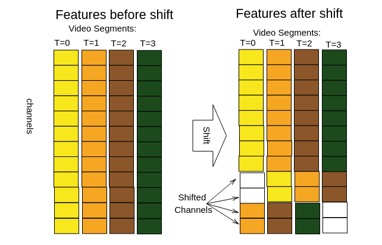
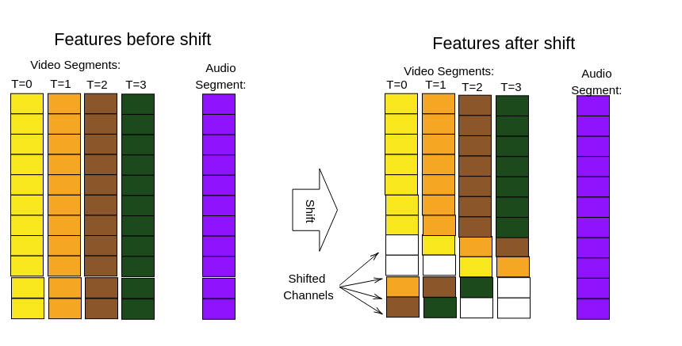

# TSAM: Temporal Shift with Audio Modality 


## Overview
This code extends the [TemporalShiftModule](https://github.com/mit-han-lab/temporal-shift-module) codebase. 

We have implemented several extensions to adapt TSAM for general purpose video undestanding ([including emotion recognition](Adcumen.pdf)):


- incorporates audio modality
- extends shift with depth parameter (shift not only neighboring but distant frames )
- use weigths ptretrained with INET21K

All this improves perfomance of TSM on kinetics400 and something-something-v1 datasets:


| dataset      | n-frame      | TSM   | **TSAM**  |
|--------------|--------------|-------|-----------|
| Kinetics 400 | 16 * 10clips | 74.5% | **78.0%** |
| something-v1 | 16 * 10clips | 48.4% | **52.2%** |

##### Table 1. Perfomance on public dataset TSAM vs TSM. In both cases Resnet50 was used as backbone. 


## TSAM vs TSM
Figures below describe our extensions, more details could be found in the [technical report](TSAM.pdf).




<p align = "left">
Fig.1 - Original TSM implementation: video segments shifted by 1 segment.
</p>




<p align = "left">
Fig.2 - TSAM implementation: video segments shifted by 1 , 2, .., k segments. Audio segment is not shifted but processed by the same backbone (weights are the same for video and audio segments).
</p>


## Prerequisites

The code is built with following libraries:

- [PyTorch](https://pytorch.org/) 1.0 or higher
- [tqdm](https://github.com/tqdm/tqdm.git)
- [timm](https://github.com/rwightman/pytorch-image-models)
- [scikit-learn](https://scikit-learn.org/stable/)


## Data Preparation

You need to prepare 2 config files: 

- config file to specify input data (use template from  [config/example_data.json](config/example_data.json))
- config file to specify model parameters (use template from  [config/example_config.json](config/example_config.json))

Config files controls all parametrers for your run and saved along with results. So later you can easily recover results with parameters. 

#### Config File Data ( see example:  [example/videos4test](example/videos4test) ):

First you need to set dataset folder and edit "dataset" config file:

	"data_dir": "videos4test",          <- full path to dataset_folder folder (see below DataSet Folder Structure)
    "dir_videos": "videos",             <- relative to "data_dir" folder with videos
    "dir_frames": "frames",             <- relative to "data_dir" folder with frames
	"dir_audios": "audios",             <- relative to "data_dir" folder with audio (.wav files)
	"file_train_list": "training.txt",  <- relative to "data_dir" file with labels for videos used for training (see example) 
	"file_val_list": "validation.txt",  <- relative to "data_dir" file with labels for videos used for vaidation (see example)
	"frames_tmpl": "{:05d}.jpg"         <- template for frame names

see example:  [training.txt](example/videos4test/training.txt) file

see example:  [validation.txt](example/videos4test/validation.txt) file

Recomended DataSet Folder Structure (see [videos4test](videos4test) folder):
    
    ├── dataset_folder
         │
         ├── Videos    <- Contains all videos (train, validation, test).
         │
         ├── Frames  <- Contains all frames from videos  (train, validation, test)
         │
         ├── Audios  <- Contains all audio (.wav) files (train, validation, test).
         │
         ├── training.txt    <- List of videos (only ids) for training (with labels, labels must be consecutive integers starting from 0, .., k  ) .
         └── validation.txt  <- List of videos (only ids) for validation( with labels)


Attention!!!: labels must be consecutive integers starting from 0, 1,2, .. 

### Config File : 

Config File has the following subsections:

- data_augmentation (specifies params for data augmentation )
- model (specifies params for model)
- shift_temporal (specifies parameters for the shift)
- training_param (specifies parameters for the training)
- optimizer_param (specifies parameters for optimizer, and learning schedule)
- model_validation (specifies the number of sampled clips in validation run)
- results_folder (specifies path to the output folder)


#### Config File: "data_augmentation" :
In this section you can modify augmentation parameters. 

#### Config File: "model" :
Specify model parameters:

    "video_segments": 8,          <- number of frames to sample from the video
    "audio_segments": 1 or 0,     <- should be 1 (include audio modality) or 0 (not include)
    "arch": "resnet50_timm",      <- specify backbone 
	"dropout": 0.5                <- specify dropout rate
 


#### Config File: "shift_temporal" :
Specify modelshift parameters:

      "status": true,             <- if true apply temporalshift
      "f_div": 4,                 <- propotion of features to be shifted (propotion = 1/f_div) 
      "shift_depth": 4,           <- shift depth (how many neighboring segments are affected by shift)
      "n_insert": 2,              <- specifies blocks in backbone to be shifted
      "m_insert": 0
	
 


## Pretrained Models

To validate or predict the pretrained model you need to specify Input Data path in the data config file 
(use template from  [config/kinetics400_data.json](config/kinetics400_data.json)).


To run validation in MultiClip mode (pretrained on kinetics400) :

```bash
# test kinetics400
python main.py --data config/kinetics400_data.json --config config/kinetics400_config.json --validate kinetics400 --device 0,1,2,4
   
```

To validate or predict the pretrained model you need to specify Input Data path in the data config file 
(use template from  [config/something_v1_data.json](config/something_v1_data.json)).
```bash
# test Something-Something V1
python main.py --data config/something_v1_data.json --config config/something_v1_config.json --validate something_v1 --device 0,1,2,4
   
```

## Framing Videos

For video data pre-processing, you need [ffmpeg](https://www.ffmpeg.org/) to be installed.

Use our script to frame videos:

```bash
# will frame example video4test videos into video4test/frames and video4test/audios
python3 video2frames.py --data config/example_data.json --fps 10

#where --fps specifies frame-per-second rate (10 is default value)

# will extract .wav audio files from example "video4test" videos into video4test/audio 
python3 video2frames.py --data config/example_data.json --audio
```

## Train Model

To train  your model on your data you need to specify Input Data path in the data config file 
(use template from  [config/kinetics400_data.json](config/kinetics400_data.json)). 


```bash
# to train on kinetics dataset: 
python main.py --data config/kinetics400_data.json --config config/kinetics400_config.json --device 0,1,2,4 --run_id "MyRunId"

#the path to output is specified in config folder: "results_folder": "results"
# so the results folder is "results/MyRunId"    
```

```bash
# to run example train on toy dataset (you need to frame videos before  (see above "Framing Videos")): 
python main.py --data config/example_data.json --config config/example_config.json --device 0,1,2,4 --run_id "MyRunId"

#the path to output is specified in config folder: "results_folder": "results"
# so the results folder is "results/MyRunId"    
```
